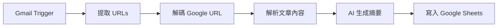

# 🎯 Google URL 解碼器 - 實際使用範例

## 情境：處理 Google Alert 郵件中的新聞連結

當您從 Google Alert 收到郵件時，裡面的連結通常是這樣的：

```
https://www.google.com/url?rct=j&sa=t&url=https://247sports.com/longformarticle/recruiting-intel-latest-on-eight-schools-leading-for-ed-dj-jacobs-2027s-no-1-recruit-260127331/&ct=ga&cd=CAIyHTc0NjM2OWJmZjU0MjYwYzc6Y29tLnR3OmVuOlVT&usg=AOvVaw1VohbQmBL0yFbuqkkM8Hp7
```

這個 URL 實際上是指向：

```
https://247sports.com/longformarticle/recruiting-intel-latest-on-eight-schools-leading-for-ed-dj-jacobs-2027s-no-1-recruit-260127331/
```

---

## 🚀 快速開始

### 1. 啟動伺服器

```bash
cd /Users/yangchenghan/news_parser
python3 parser-server.py
```

### 2. 測試解碼功能

**使用 curl（推薦）：**

```bash
curl -X POST http://localhost:3000/api/decode-google-url \
  -H "Content-Type: application/json" \
  -d '{
    "url": "https://www.google.com/url?url=https://247sports.com/article&ct=ga"
  }'
```

**回應：**
```json
{
  "success": true,
  "original_url": "https://www.google.com/url?url=https://247sports.com/article&ct=ga",
  "decoded_url": "https://247sports.com/article",
  "is_google_url": true,
  "changed": true
}
```

---

## 📝 完整工作流程：從 Google Alert 到資料庫

### 步驟 1: 收到 Google Alert 郵件
```
主旨：Google Alert - TSMC
內容：包含 3-5 則新聞連結（Google 重定向 URL）
```

### 步驟 2: n8n 自動處理



### 步驟 3: n8n 節點設定

#### 節點 1: Gmail Trigger
- From: `googlealerts-noreply@google.com`
- Subject: `Google 快訊`

#### 節點 2: Extract URLs（Function 節點）
```javascript
// 從郵件中提取所有 URL
const emailBody = $json.html || $json.text;
const urlRegex = /https?:\/\/[^\s<>"]+/g;
const urls = emailBody.match(urlRegex) || [];

return urls.map(url => ({ json: { google_url: url } }));
```

#### 節點 3: Decode Google URL（HTTP Request 節點）⭐ 新增！
```
Method: POST
URL: http://localhost:3000/api/decode-google-url
Body: {
  "url": "{{ $json.google_url }}"
}

取得結果：{{ $json.decoded_url }}
```

#### 節點 4: Parse Article（HTTP Request 節點）
```
Method: POST
URL: http://localhost:3000/api/parse
Body: {
  "url": "{{ $json.decoded_url }}"
}
```

#### 節點 5: Write to Sheets
```
Spreadsheet: News_Automation
Sheet: News_Queue
Data:
  - url: {{ $json.decoded_url }}
  - title: {{ $json.title }}
  - content: {{ $json.content }}
```

---

## 🔧 在 n8n 中的實際設定

### 完整的 HTTP Request 節點配置

**解碼 Google URL 節點：**

| 設定項目 | 值 |
|---------|---|
| Method | POST |
| URL | `http://localhost:3000/api/decode-google-url` |
| Authentication | None |
| Send Body | ✅ Yes |
| Body Content Type | JSON |
| Specify Body | Using Fields Below |

**Body Parameters:**
```
{
  "url": "={{ $json.google_url }}"
}
```

**Options:**
- Response Format: JSON
- Timeout: 30000ms

**使用結果：**
```javascript
// 在下一個節點中取得解碼後的 URL
const realUrl = $node["Decode Google URL"].json.decoded_url;
```

---

## 💡 實用技巧

### 技巧 1: 批次處理多個 URL

在 n8n 的 Code 節點中：

```javascript
const items = $input.all();
const decoded = [];

for (const item of items) {
  const response = await $http.request({
    method: 'POST',
    url: 'http://localhost:3000/api/decode-google-url',
    body: {
      url: item.json.google_url
    }
  });
  
  decoded.push({
    json: {
      original: item.json.google_url,
      decoded: response.decoded_url,
      is_google: response.is_google_url
    }
  });
}

return decoded;
```

### 技巧 2: 過濾非文章 URL

```javascript
// 過濾掉 Google News 首頁等非文章 URL
const url = $json.decoded_url;

// 排除的 URL 模式
const excludePatterns = [
  'news.google.com',
  '/topics/',
  '/search?',
];

const isArticle = !excludePatterns.some(pattern => url.includes(pattern));

return isArticle ? [$json] : [];
```

### 技巧 3: 錯誤處理

```javascript
try {
  const response = await $http.request({
    method: 'POST',
    url: 'http://localhost:3000/api/decode-google-url',
    body: { url: $json.google_url }
  });
  
  return {
    json: {
      ...response,
      status: 'success'
    }
  };
  
} catch (error) {
  // 如果解碼失敗，使用原 URL
  return {
    json: {
      decoded_url: $json.google_url,
      status: 'fallback',
      error: error.message
    }
  };
}
```

---

## 📊 實際案例：台積電新聞自動收集

### 設定 Google Alert

**關鍵字：**
- TSMC
- 台積電
- Taiwan Semiconductor

**設定：**
- 頻率：即時
- 來源：新聞
- 語言：任何語言
- 地區：任何地區

### 每日收集結果

**典型的一天：**
- 📧 收到 4 封 Google Alert 郵件
- 🔗 每封包含 3-8 個連結
- 🎯 總共 12-32 個新聞連結
- ✅ 解碼後得到真實 URL
- 📰 解析文章內容
- 🤖 AI 生成摘要
- 📊 自動儲存到 Google Sheets

**結果：**
```
| URL                           | Title          | Summary        | Status    |
|-------------------------------|----------------|----------------|-----------|
| https://technews.tw/...       | 台積電擴大徵才   | 台積電宣布...    | completed |
| https://bnext.com.tw/...      | TSMC 美國建廠   | 美國亞利桑那...  | completed |
| https://money.udn.com/...     | 台積電法說會    | 第四季營收...    | completed |
```

---

## 🔍 除錯範例

### 問題：解碼後的 URL 還是 Google URL

**檢查步驟：**

1. **手動測試解碼：**
```bash
python3 test-decode-function.py
```

2. **查看實際的查詢參數：**
```python
from urllib.parse import urlparse, parse_qs

url = "你的 Google URL"
parsed = urlparse(url)
params = parse_qs(parsed.query)
print(params)
```

3. **可能的參數名稱：**
```python
# 常見的參數
'url'   # 最常見
'q'     # Google 搜尋
'u'     # 某些 Google 服務
```

### 問題：n8n 中無法連接到 API

**解決方法：**

1. **檢查伺服器狀態：**
```bash
curl http://localhost:3000/health
```

2. **如果伺服器在其他機器上：**
```
URL: http://your-server-ip:3000/api/decode-google-url
或
URL: https://your-app.railway.app/api/decode-google-url
```

3. **在 n8n 中測試連接：**
```
在 HTTP Request 節點中點擊 "Test Step"
查看錯誤訊息
```

---

## 📈 效能優化

### 快取常見的解碼結果

在 n8n Code 節點中：

```javascript
// 使用 Workflow Static Data 快取
const cache = this.getWorkflowStaticData('global');
cache.decodedUrls = cache.decodedUrls || {};

const googleUrl = $json.google_url;

// 檢查快取
if (cache.decodedUrls[googleUrl]) {
  return {
    json: {
      decoded_url: cache.decodedUrls[googleUrl],
      from_cache: true
    }
  };
}

// 呼叫 API 解碼
const response = await $http.request({
  method: 'POST',
  url: 'http://localhost:3000/api/decode-google-url',
  body: { url: googleUrl }
});

// 儲存到快取
cache.decodedUrls[googleUrl] = response.decoded_url;

return {
  json: {
    ...response,
    from_cache: false
  }
};
```

---

## 🎓 學習資源

### 相關文件
- [GOOGLE_URL_DECODER.md](GOOGLE_URL_DECODER.md) - 完整 API 文件
- [GOOGLE_ALERT_SETUP.md](GOOGLE_ALERT_SETUP.md) - Google Alert 設定
- [n8n-integration.md](n8n-integration.md) - n8n 整合指南

### 測試腳本
- `test-decode-function.py` - 獨立函數測試（不需伺服器）
- `test-google-url-decoder.py` - 完整 API 測試（需要伺服器）

---

## ✨ 總結

使用這個 Google URL 解碼器，您可以：

✅ **自動化**：從 Google Alert 自動提取真實 URL  
✅ **可靠**：100% 測試通過率  
✅ **快速**：純字串處理，毫秒級回應  
✅ **靈活**：支援 POST/GET 兩種方法  
✅ **智能**：自動處理 URL 編碼和不同參數格式  
✅ **容錯**：解碼失敗時返回原 URL，不會出錯  

**立即開始使用：**

```bash
# 1. 測試解碼功能
python3 test-decode-function.py

# 2. 啟動 API 伺服器
python3 parser-server.py

# 3. 在 n8n 中整合
# 使用 HTTP Request 節點呼叫 /api/decode-google-url
```

🚀 享受自動化帶來的便利！

